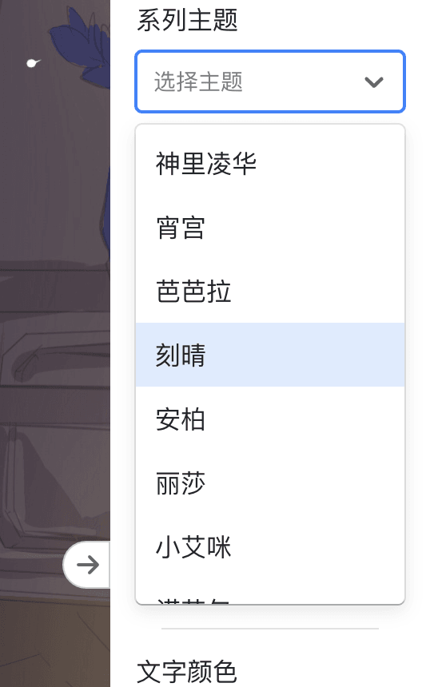
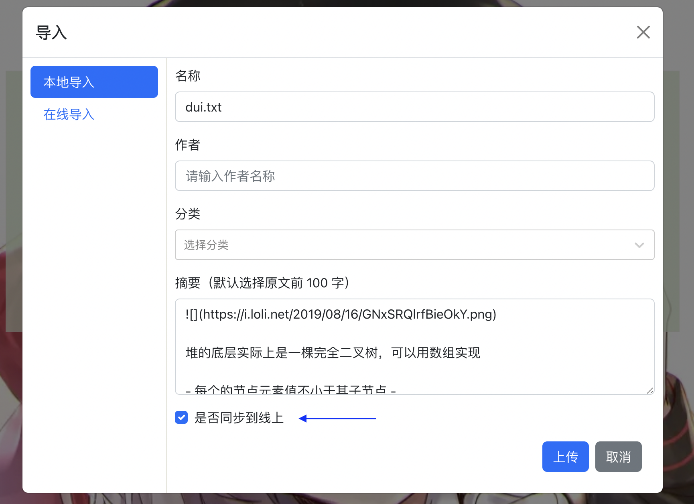
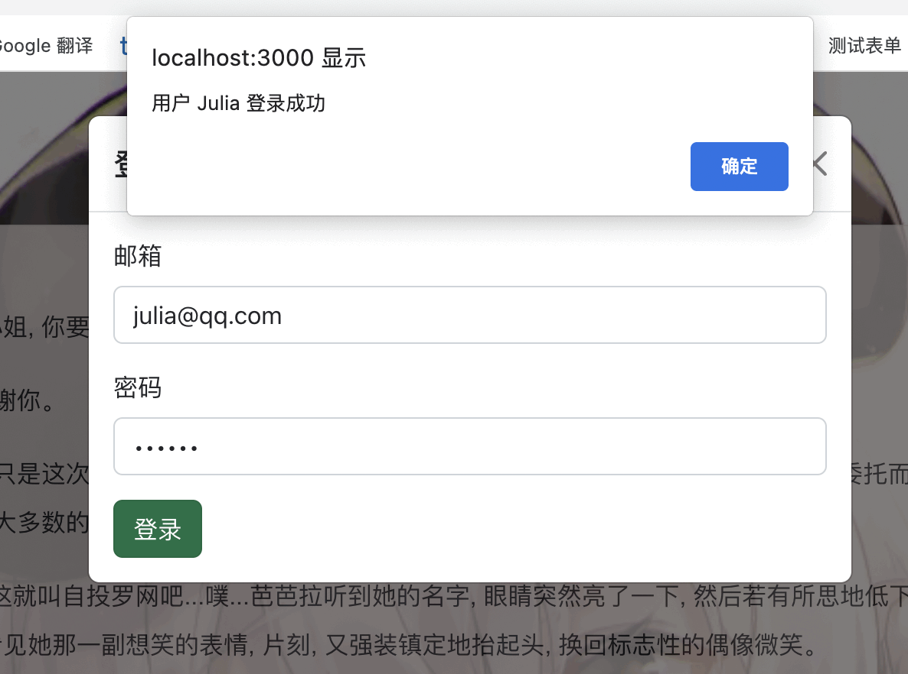
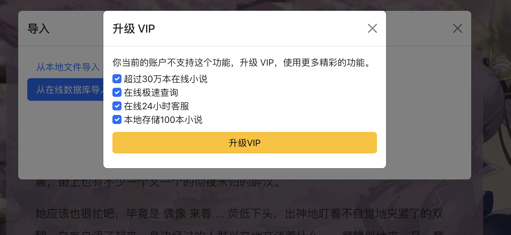

# 1.阅读器功能说明

## 1.1 离线模式

核心功能是纯文本小说阅读应用，包括用户上传小说，分章节视图，分页面视图，自定义页面样式（文字颜色，文字粗细，整体色调，背景颜色），支持了很多可爱的卡通背景图片。

整体界面左中右布局

左侧导航栏：支持本地上传，或者在线搜索文档，并以列表形式展示；另一个 tab 是不同章节的树状图展示

中间阅读栏：预览模式（全页模式，分页模式，全屏模式）

右侧设置栏：可以切换 tab，分别是基本设置和高级设置

## 1.2 在线模式

在离线模式基础上，1.0 版本支持用户操作：用户登录，用户注册，后台管理等功能；支持小说操作：在线搜索小说，下载小说，上传小说等功能。

## 1.3 细节功能

左侧切换大纲和分页，右侧设置基本样式和阅读模式。

设置栏可以支持拖动改变宽度，效果如下

点击下方派蒙，可以返回到顶部

不同主题原神主题色系

支持本地上传到数据库

支持初步用户登录和验证

支持全屏模式和快捷键阅读

支持不同权限管理

其他具体实现和项目排期比较多，所以放在线上了

链接：https://cloud.seatable.cn/dtable/external-links/7995693695bc430db4f3/

## 1.4 项目排期

项目排期和主要功能见下表。

<iframe className="dtable-embed" src="https://cloud.seatable.cn/dtable/external-links/7995693695bc430db4f3/" frameBorder="0" width="100%" height="667" style="background: transparent; border: 1px solid #ccc;"></iframe>

具体支持了下面的功能。

[前端] 背景水印

[前端] 本地存储阅读记录

[前端] 分页分章节

[前端] 界面 UI 统一

[前端] 大文件性能问题

[前端] 支持多语言切换

[前端] 左侧侧边栏支持隐藏

[前端] 左侧支持搜索

[前端] React 优化

[前端] react-redux 实现状态管理

[前端] token 存储在本地

[前端] TS 语言重构项目

[后端] 代码分离

[后端] 服务器性能问题

[后端] 搜索逻辑优化

[后端] 下载次数和时间统计

[后端] 用户密码数据库加密

[后端] express 优化

[产品] 界面统计

[产品] 支持二维码分享
