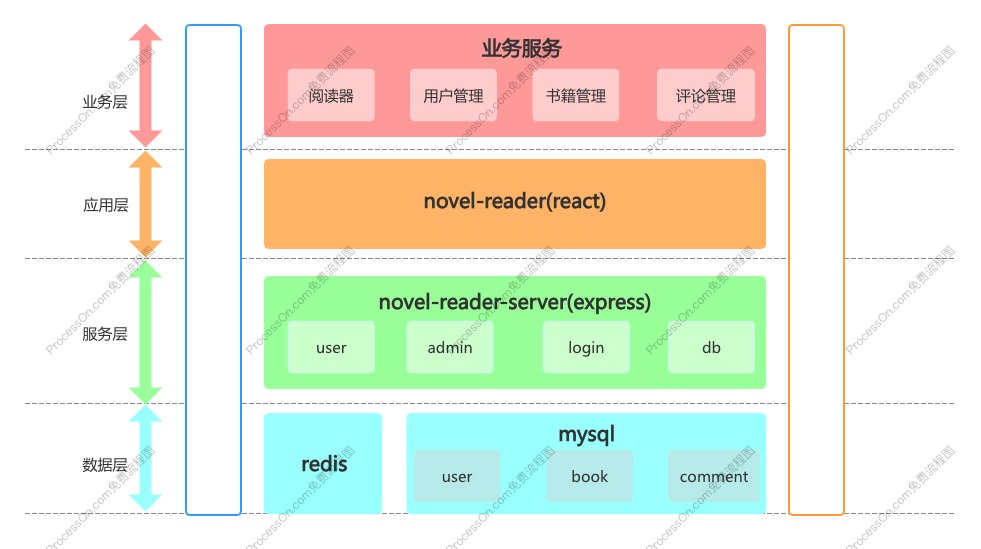
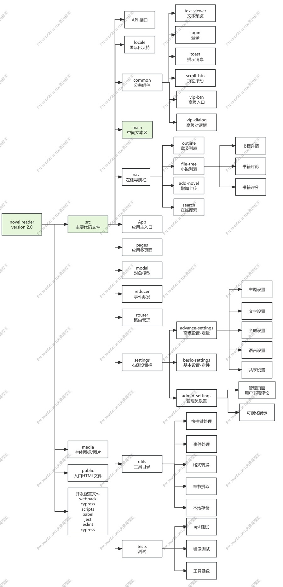
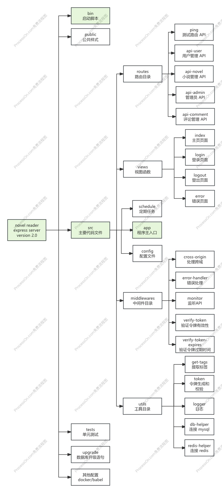

## 2.1 项目文件架构说明

### 2.1.1 整体结构

这是小说阅读系统整体架构图，展示了系统从下到上不同层次的组成和功能。

项目从下到上分成四层：

1. 数据层：使用了`redis`和`mysql`数据库。`mysql`中包含`user`（用户）、`book`（书籍）、`comment`（评论）等数据模块，用于存储系统的核心业务数据。`redis`用于缓存书籍数据，提升系统读取速度。
2. 服务层：`novel-reader-server`基于`express`框架搭建，负责处理业务逻辑，包含`user`（用户）、`admin`（管理员）、`login`（登录）以及与数据库交互的`db`模块。
3. 应用层：`novel-reader`基于`react`框架，是系统的主要应用部分，负责呈现用户界面和与用户交互。
4. 业务服务层：提供具体的业务功能，如`阅读器`、`用户管理`、`书籍管理`、`评论管理` 等，是直接面向用户需求的功能模块。

### 2.1.2 前端结构

下面是小说阅读器前端架构图（novel reader version 2.0），代码和功能模块组织架构设计精巧，具有良好的分层和模块化特点，便于开发、维护和扩展。

主要目录和功能

1. App 主入口：作为整个应用的起始点，负责初始化应用程序，加载其他必要的模块和组件，是整个项目运行的关键起点。
2. pages 页面：管理应用中的不同页面，每个页面可能对应着小说阅读器的不同功能视图，方便进行页面级别的开发和管理。
3. modal 对象模型：定义应用中的数据模型和业务逻辑对象，例如书籍信息模型、确保数据的一致性和规范性，为其他模块提供数据交互的基础。
4. reducer 事件派发：遵循特定的架构模式（Redux），用于处理应用中的状态变化，通过集中管理状态，使得状态的更新和追踪更加容易，提高应用的可维护性。
5. router 路由管理：负责管理应用中的路由，决定用户在不同 URL 路径下看到的页面内容，实现页面之间的跳转和导航功能。
6. main 中间文本区组件
   - API 接口：用于与后端服务器进行数据交互，获取书籍内容、用户信息等数据，或者向服务器发送操作请求，如评论等。
   - locale 国际化支持：实现多语言功能，使应用能够根据用户的语言设置显示不同语言的界面内容，扩大应用的使用范围。
   - common 公共组件：包含多个可复用的组件，如文本预览（text - viewer）、登录（login）、提示消息（toast）等，减少代码重复，提高开发效率。
   - 其他功能：还包括页面滚动、高级入口等功能组件，丰富阅读体验。
7. nav 左侧导航栏组件：提供用户快速访问不同功能的入口，如章节列表、小说列表、添加小说、在线搜索，方便用户操作。
8. settings 右侧设置栏
   - basic - settings 基本设置（定性）：包含主题设置、文字设置、全屏设置等基本的用户个性化设置选项。
   - advance - settings 高级设置 （定量）：除了基本设置外，还涵盖语言设置、共享设置等更高级的功能。
   - admin - settings 管理员设置：专门为管理员提供的功能，如管理页面、处理用户书籍评论等，有助于维护应用的秩序和内容管理。
9. utils 工具目录：提供各种实用工具函数，如快捷键处理、事件处理、格式转换、章节提取、本地存储管理等，为项目的各个部分提供功能性支持。

其他目录

1. media：存放字体图标和图片等静态资源。
2. public：包含入口 HTML 文件，是整个 Web 应用的基础页面结构，所有的 JavaScript 和 CSS 等资源都会在这个 HTML 文件中进行加载和初始化。
3. 开发配置文件：涵盖了多个开发和测试工具的配置文件，如 webpack 用于项目的打包和构建，cypress 用于端到端测试，babel 用于代码的转译等，确保项目在不同环境下能够正常运行和测试。
4. tests 测试：包含多种测试功能，如 API 测试、镜像测试等，以及工具函数测试，通过这些测试可以保证项目的质量和稳定性，及时发现和修复潜在的问题。

### 2.1.3 后端结构

这是基于 Express 框架的小说阅读器服务器（novel reader express server version 2.0）项目架构图，展示了项目各部分的组成和功能：

- bin：存放启动脚本，用于启动整个服务器应用。
- public：存储公共样式文件，负责网页的外观显示风格。
- src 主要代码
  - app：程序主入口，初始化应用并加载其他模块。
  - config：包含配置文件，如处理跨域和错误处理等设置。
  - middlewares：中间件目录，包含监听 API、令牌验证等功能，在请求处理过程中发挥作用。
  - utils：工具目录，提供标签提取、日志记录、数据库连接等工具函数。
  - routes：路由目录，定义各类 API 接口，如测试路由、用户管理、小说管理等。
  - views：视图函数，管理不同页面，如主页、登录、登出和错误页面。
  - schedule：设置定期任务，自动执行特定操作。
- tests：用于单元测试，保证各功能模块正常运行。
- upgrade：存放数据库升级语句，方便更新数据库结构和内容。
- 其他配置：涉及 docker 和 babel 相关配置，用于项目的容器化部署和代码转换。

